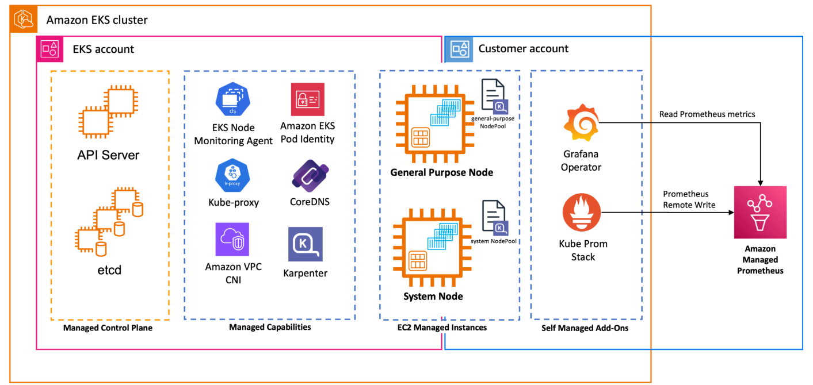
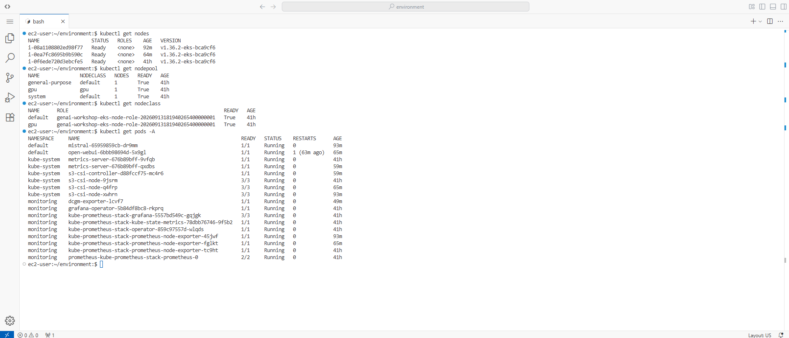
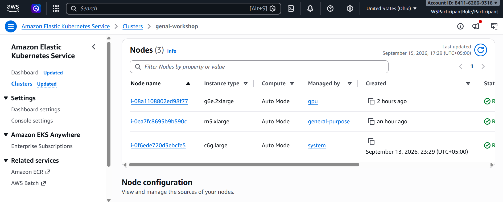
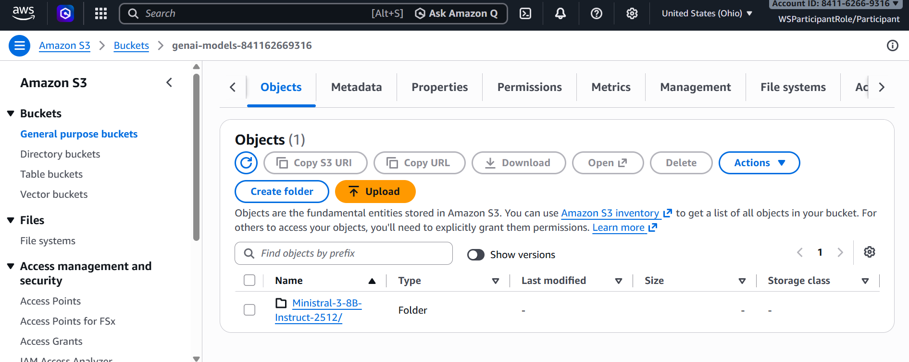
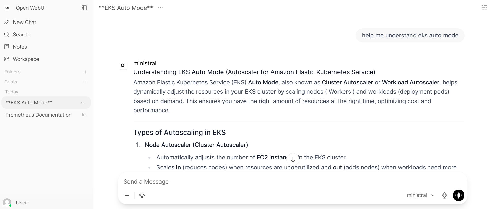
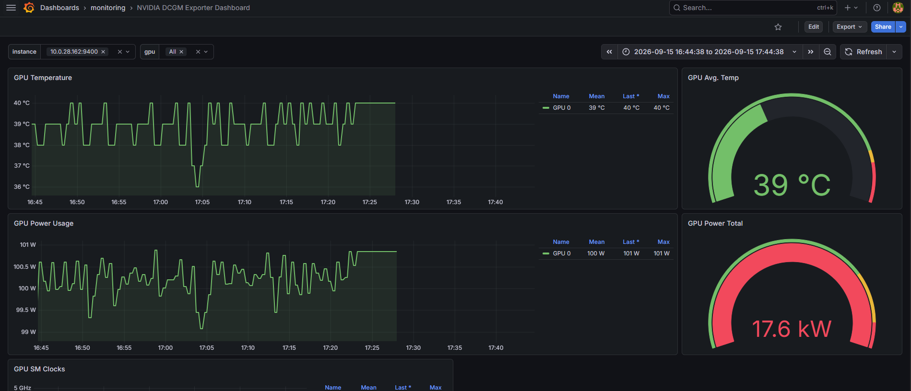
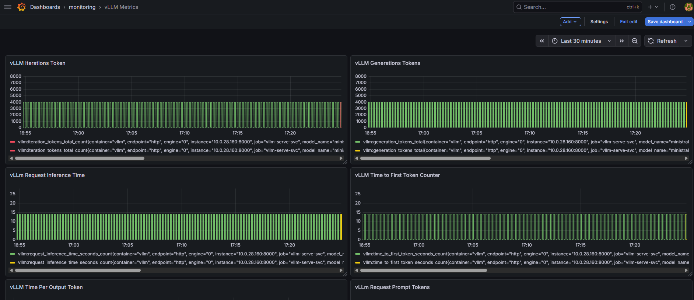

## GPU-Accelerated LLM Inference on Amazon EKS

A hands-on implementation of a GPU-accelerated LLM inference platform on
Amazon EKS, covering GPU provisioning, vLLM serving, S3-based model loading,
and end-to-end inference observability.

## Overview

This project documents my hands-on work implementing and analyzing an
LLM inference platform on Amazon EKS.

The goal was not simply to deploy an LLM.

The goal was to understand the infrastructure required to run GPU-backed
inference workloads and how to observe and diagnose their behavior under load.

The platform brings together:

- Amazon EKS
- EKS Auto Mode
- GPU NodePools and NodeClasses
- NVIDIA GPUs
- vLLM
- Run:ai Model Streamer
- Amazon S3
- SOCI
- Prometheus
- Grafana
- Grafana Operator
- NVIDIA DCGM Exporter
- vLLM engine metrics
- Inference benchmarking

## What I Explored

- GPU workload provisioning with EKS Auto Mode
- Kubernetes GPU scheduling using `nvidia.com/gpu`
- GPU NodePool and NodeClass concepts
- GPU taints and tolerations
- Running vLLM on NVIDIA GPU infrastructure
- LLM model loading directly from Amazon S3
- Run:ai Model Streamer with vLLM
- GPU and Kubernetes observability
- NVIDIA DCGM GPU telemetry
- vLLM engine-level observability
- TTFT, TPOT, token throughput, and request latency
- Identifying inference saturation and bottlenecks

## Architecture

The following architecture is based on the AWS GenAI on EKS workshop
architecture used during the hands-on implementation.

> **Architecture reference:** AWS GenAI on EKS workshop.
> The workshop provided the hands-on environment and guided architecture.
> This repository documents my implementation, technical understanding,
> and observations from the environment.

## Walk-through

### 1. Amazon EKS GPU Infrastructure

The workload runs on Amazon EKS with EKS Auto Mode provisioning the
required compute capacity.

The GPU workload uses a dedicated GPU NodePool and NodeClass, allowing
GPU capacity to be provisioned when required by the workload.

  

### 2. LLM Model Storage in Amazon S3

The model weights are stored in Amazon S3 rather than being maintained
as a separate persistent model copy inside the Kubernetes cluster.

  

### 3. vLLM Inference

vLLM runs the LLM inference workload on the provisioned NVIDIA GPU.

Run:ai Model Streamer is used as the vLLM model loader to stream model
weights directly from Amazon S3.

The inference engine exposes an API for serving model requests.

  

### 4. NVIDIA GPU Observability

NVIDIA DCGM Exporter exposes GPU telemetry to Prometheus.

The Grafana dashboard provides visibility into:

- GPU utilization
- GPU memory
- GPU temperature
- GPU power
- SM clocks
- Tensor Core utilization

  

### 5. vLLM Engine Metrics

GPU utilization alone does not explain inference performance.

The vLLM engine dashboard provides visibility into:

- Time to First Token (TTFT)
- Time Per Output Token (TPOT)
- Request latency
- Token throughput
- Request queue time
- KV-cache utilization
- Scheduler state
- Prefill and decode timing

These metrics help connect what the user experiences with what the
inference engine is doing internally.

## Observability

The observability pipeline connects infrastructure telemetry with
inference-level metrics.

This provides visibility at multiple layers:

### Kubernetes

- Node health
- Workload state
- Kubernetes object state

### GPU

- GPU utilization
- GPU memory
- GPU temperature
- GPU power
- Tensor Core activity

### vLLM

- Time to First Token (TTFT)
- Time Per Output Token (TPOT)
- Token throughput
- Request queue time
- KV-cache utilization
- Scheduler state

## Inference Performance

The project also explored the relationship between workload pressure,
vLLM engine behavior, and GPU utilization.

A request moves through the inference engine approximately as follows:

- Request arrives
- Request enters the queue
- Prompt is processed during prefill
- First token is generated
- Output tokens are generated during decode
- Request completes

This makes it possible to reason about performance rather than looking
at a single metric in isolation.

For example, as workload increases:

- Queue time can increase
- Waiting requests can increase
- Time to First Token (TTFT) can increase
- Overall inference latency can increase

GPU telemetry can then be correlated with these engine metrics to
determine whether the bottleneck is related to GPU utilization,
memory pressure, scheduling, or inference behavior.

## Key Takeaways

### GPU Infrastructure

- EKS Auto Mode can provision GPU capacity based on workload requirements.
- NodePools describe the compute requirements for workloads.
- NodeClasses describe the AWS-side configuration of the resulting nodes.
- GPU taints prevent ordinary workloads from consuming expensive GPU capacity.

### LLM Serving

- vLLM provides the inference runtime for the deployed model.
- Continuous batching and KV-cache management are important for serving
  concurrent inference requests.
- Model loading and inference execution are separate concerns.

### Model Delivery

- Model weights can be stored in Amazon S3.
- Run:ai Model Streamer can load model weights directly from S3 through vLLM.
- SOCI and model streaming address different startup bottlenecks:
  container image startup versus model weight loading.

### Observability

- NVIDIA DCGM provides visibility into GPU behavior.
- vLLM metrics provide visibility into inference-engine behavior.
- Prometheus and Amazon Managed Prometheus provide the metrics pipeline
  and backend.
- Grafana provides visualization and operational analysis.

### Performance Engineering

The main lesson from the project was:

> **GPU utilization alone is not enough to understand LLM inference performance.**

A useful inference platform needs to correlate:

- User experience
- TTFT, TPOT, and request latency
- vLLM engine state
- KV-cache utilization
- Scheduler and queue behavior
- GPU utilization and memory

## AWS Workshop Attribution

This project was completed as a hands-on implementation based on the
**AWS GenAI on EKS workshop**.

AWS provided the workshop environment, resources, baseline architecture,
and guided exercises.

My focus was on implementing the components, understanding the underlying
Kubernetes and AWS infrastructure, analyzing vLLM inference behavior, and
documenting the observability and performance concepts demonstrated by
the environment.

This project is therefore presented as a **guided hands-on implementation
and technical analysis**, rather than as an independently designed
production platform.

## Technologies

`Amazon EKS` · `EKS Auto Mode` · `Kubernetes` · `NVIDIA GPU` · `vLLM` ·
`Run:ai Model Streamer` · `Amazon S3` · `SOCI` · `Prometheus` ·
`Amazon Managed Prometheus` · `Grafana` · `Grafana Operator` ·
`NVIDIA DCGM Exporter`

## Reference

**AWS GenAI on EKS Workshop**

This repository documents the hands-on implementation and technical
understanding gained from the workshop environment, with emphasis on
GPU infrastructure, LLM inference, observability, and performance analysis.

